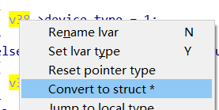

* content
{:toc}

### Diary 2019

#### 2019-10-25

1. 内核利用mmap相关:mwri-mmap-exploitation-whitepaper
* file_operations 中的函数指针定义了操作
* mmap handler 为空的时候依然可以将地址mmap回来，但是没有物理地址与其对应，再访问返回的地址会造成panic
* vm_operations_struct 中定义了处理allocated memory region 的操作

漏洞点： 
* 缺少输入校验
* 整数溢出 / 带符号整数问题
exp: scan cred / cred spray 

没有找到可以练习的漏洞,Framaroot是mmap相关的问题,可惜版本太老, 有空自己写源码复现

2. [Android 扫描漏洞套件](https://github.com/AndroidVTS/android-vts/releases)
扫了nexus5 发现很多media的洞, 有空提上日程
3. [google ctf wp](https://hackmd.io/@gzUPn_btRq2TbqRUdfX9Cw/rkfEQo4gH#Monochromatic)
4. [*ctf hackme](https://github.com/sixstars/starctf2019/tree/master/pwn-hackme)
5. https://duasynt.com/blog/linux-kernel-heap-spray

#### 2019-10-31

1. 朋友发来了练手的题目,看了下seccomp过滤,顺便改了下出了道新题目，考一些shellcode 编写和简单leak

[hitcon-quals-2017-seccomp](https://blukat29.github.io/2017/11/hitcon-quals-2017-seccomp/)
[seccomp学习笔记](https://veritas501.space/2018/05/05/seccomp学习笔记/)
2. 整理了下自己的pwn模板, 稍微改了下兼容性

#### 2019-11-1

1. 使用stdout 结构体泄露libc地址，就是修改write_base 的最低位，flag = 0xfbad1800 就行了。
网上题目大都是tcache相关的，我跟着思路出了个旧版libc的，unsorted bin attack 和 fastbin attack 结合起来就行了
2. 相关题目
[lctf2018-pwn-easy_heap](https://ctf-wiki.github.io/ctf-wiki/pwn/linux/glibc-heap/tcache_attack-zh/#challenge-1-lctf2018-pwn-easy_heap)
[sctf2019-pwn_one_heap](http://blog.eonew.cn/archives/1076#pwn_one_heap)

#### 2019-11-9

1. 湖湘杯
leak libc相关题目
https://blog.csdn.net/weixin_42151611/article/details/99228675
https://blog.csdn.net/qq_41252520/article/details/101620453
https://xz.aliyun.com/t/5853

2. 写一个gdb 插件, 可以自动设置解析地址的，兼容静态编译的情况，今天碰到很被动
3. android ROM 逆向开坑
https://bbs.pediy.com/thread-254831.htm
https://bbs.pediy.com/thread-254830.htm

#### 2019-11-13

1. 出了一道wasm的题
2. [llvm 去平坦化](https://github.com/cq674350529/deflat)
3. [SUCTF 2019 逆向](https://www.52pojie.cn/forum.php?mod=viewthread&tid=1039478extra=page%3D1%26filter%3Dauthor%26orderby%3Ddateline#28221000_hardcpp)
4. [协程切换的临界区块控制不当而引发的UAF血案](https://bbs.pediy.com/thread-224686.htm)
5. https://retdec.com/

#### 2019-11-15  

1. Dockfile 只支持相对路径的COPY
2. 删除所有错误镜像 `docker rmi $(docker images | grep "none" | awk '{print $3}')` 

#### 2019-11-16

1. 逆向工具 https://cutter.re/

#### 2019-11-21  

1. 补充了一下heap的ppt, 发现还有好多坑没有填上，比如 SROP / house of orange的后续libc版本bypass / IO stdout的leak

#### 2019-11-22

1. 总结堆管理及其利用，文章和ppt 提上日程，可以尝试一下web端的ppt制作，尽量精简

#### 2019-11-28

1. C# 入门, 解决了using 找不到的问题, 可以在VS项目中添加引用。软件保护[ConfuserEx](https://yck1509.github.io/ConfuserEx/)和[NoFuserEx](https://github.com/CodeShark-Dev/NoFuserEx)
2. [modern-windows-userspace-exploitation](https://github.com/saaramar/35C3_Modern_Windows_Userspace_Exploitation#35c3-modern-windows-userspace-exploitation)
3. `git clone --recursive` 递归下载
4. 看了一些路由器漏洞方面的漏洞，原理都是简单的栈溢出

#### 2020-1-5

1. 入门xposed 框架 , 需要搞一个关机劫持的功能做演示。
搜了一下是有这样的恶意软件hijackPowerOff , github找到一个实现
[hijackAndroidPowerOff](https://github.com/monstersb/hijackAndroidPowerOff)
但是使用xposed 框架 ，基本可以满足需求。

后续再讨论如何在没有框架时进行进程注入。这可能是个大坑

2. Android Studio查看方法注释的快捷键 ctrl + q

#### 2020-2-12 

IE 漏洞复现
1. 复现了CVE-2012-1889
需要安装JDK 才能提供绕过ASLR的dll 
https://bbs.pediy.com/thread-215974.htm
https://github.com/whu-enjoy/CVE-2012-1889 (好用的exp)

https://theori.io/research/chakra-jit-cfg-bypass
https://theori.io/research/jscript9_typed_array

http://blogs.360.cn/post/three-roads-lead-to-rome.html

恶意apk 逆向
https://zhuanlan.zhihu.com/p/34711959

##### 2020-2-24
三星KNOX 静默安装
https://cloud.tencent.com/developer/article/1036581

##### 2020-3-6 

Android 任务劫持
### 多任务概念
* PC 多进程同一时刻运行
* Android 端 每个任务是由多个activity组成，而这些activity可能来自不同的app

taskAffinity = "com.paypal.android"
allowTaskReparenting = true
将M2移动到paypal的前台去

##### 2020-3-20 

渗透工具 使用LDAP 信道传输
https://blog.fox-it.com/2020/03/19/ldapfragger-command-and-control-over-ldap-attributes/
https://github.com/fox-it/LDAPFragger

fuzz 相关

[fuzz大集合](https://bbs.pediy.com/thread-249986.htm)

https://www.peerlyst.com/posts/the-fuzzing-wiki-learning-to-fuzz-better-peerlyst

[漏洞利用教程包含win利用](https://samsclass.info/127/127_F15.shtml)

[AFL 源码分析](https://xz.aliyun.com/t/4628)

[libFuzzerTutorial 推荐](https://github.com/google/fuzzing/blob/master/tutorial/libFuzzerTutorial.md)

[upnp协议利用](https://www.jianshu.com/p/bce3f4047a65)
https://blog.csdn.net/braddoris/article/details/41646789

https://blog.csdn.net/qq_18105691/article/details/83339101

[broadpwn](https://blog.exodusintel.com/2017/07/26/broadpwn/)

upnp 编译过后使用upnp.a 文件 制造sig文件

./pelf ./libupnp.a
./sigmake libupnp.pat upnp.sig
将sig 放入IDA 的sig目录下 ，shift + F5 打开

#### 2020-3-27
IDA添加结构体

打开 View -> open subviews -> local types , insert 插入结构体
typedef struct lelink
{
    /* data */
    char unknow[651];
    char device_type;
} lelink;
选中伪代码中某变量，选择convert to struct

远程调试
root@q201:/ # ./android_server
IDA Android 32-bit remote debug server(ST) v1.22. Hex-Rays (c) 2004-2017
Listening on 0.0.0.0:23946...

adb forward tcp:23946 tcp:23946

##### 2020-4-14

保护措施：
运行状态监控，如果发现违规操作立马禁止
检测的时间和位置
* 在写入危险字节前就停止进程
* 类似canary，允许写入，但是后续触发后结束进程

4种攻击向量

* code injection
* control-flow hijacking
* data-only attacks
* information leaks
 
CFI 

